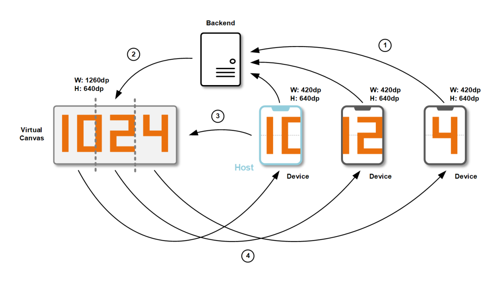

# Multiple Screens

This application is dedicated to the celebration of Chinese Programmer's Day 2020. It displays characters **1024** on a single mobile screen or across multiple ones.

[](https://youtu.be/02Q-W5qEye4)

## Architecture

To make the magic works perfectly, we need a backend server and a couple of Android mobile devices. Between backend and devices, **WebSocket(s)** play an important role in smoothing communication. 

Let's see an overview of the architecture:


The diagram above illustrates essential communication between the backend and devices. There are four steps in a drawing session:

1. In the beginning, each device in the session reports its display dimension in **DP** format.
2. Each time when there is a new device join the session, the backend will recalculate the dimension of a **virtual canvas**. Then backend will divide the canvas into several parts and map each device into a specific area. Devices will only draw the content in the area assigned to them.
3. The first device join in the session will be treated as the **host** of the session. Only the host device can send the command to the backend to control the session, including **START**, **STOP**, **PAUSE**, and **RESUME**. 
4. After the backend receives the command from the host device of the session, it will manage the overall progress for drawing and dispatching the drawing command to all the devices.

## Communication 
The backend and devices use WebSockets to communicate with each other. Communication includes different types of commands. All the devices send commands to the backend and backend responses for dispatching commands to devices. There is no direct interaction among devices.

###1. Report screen information

- **Example**

```json
{ 
	"cmdCode":"UPDATE_SCREEN_INFO",
	"uuid": "1e062fbf-281a-4172-bb5a-d9a2ac168d82", 
	"widthInDp": 420,
	"heightInDp": 640
}
```
- **Direction**: **Device** to **Backend**
- **Description**:
	
	As soon as the device connects to the backend, it sends this command to the backend to report its display dimension. The **width** and **height** should be in **DP** format since the backend tries to make sure that the content displayed on different screen should in the same physical size.

###2. Update screen information

- **Example**

```json
{
	"cmdCode": "UPDATE_SCREEN_INFO"
	"sid": "ms-426",
	"uuid": "1e062fbf-281a-4172-bb5a-d9a2ac168d82",
	"seq": 1,
	"gridWidthInDp": 16,
	"gridHeightInDp": 57,
	"drawingBoundInDp":{ 
		"left": 420,
		"top": 0,
		"right": 840,
		"bottom": 620
	}
}
```
- **Direction**: **Backend** to **Device**
- **Description**:
	
	When a device joins the session, the backend will calculate the virtual canvas size and resend this command to each device in the session. **seq** indicates the position of the device in the virtual canvas, while **drawingBoundInDp** specifies the area that this device should be responsible for. **gridWidthInDp** and **gridHeightInDp** defines the dimension of each grid in **DP** format.

###3. Control session (Start / Pause / Stop)

- **Example**

```json
{
	"cmdCode": "START_DRAWING"
	"sid": "ms-426",
	"uuid": "1e062fbf-281a-4172-bb5a-d9a2ac168d82",
}
```
- **Direction**: **Device** to **Backend**
- **Description**:
	
	The host device can send session controlling commands to the backend. **cmdCode** includes **START_DRAWING**, **PAUSE_DRAWING** and **STOP_DRAWING**. The difference between **PAUSE_DRAWING** and **STOP_DRAWING** is that session progress can be recovered after receiving **STOP_DRAWING** command.
